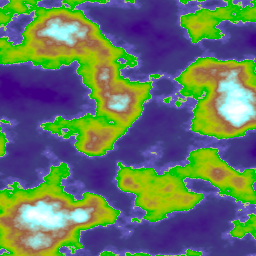

Tutorial 3: Terrain Maps
========================

In this tutorial, you'll create a program that generates and renders
a terrain height map from the output of a noise module.

Unlike the original pynoise, the functions of its noiseutils are built into
pynoise, so that you will be able to immediately output useful terrain maps
without anything extra.

Creating the terrain height map.
--------------------------------

As in previous tutorials we will create a Perlin noise source

    from pynoise.noisemodule import Perlin

    perlin = Perlin()

Now we can create a noisemap from this noise source. A noise map is a 2D array
of noise value from a given source, which can be used in games or put into images.

    from pynoise.noisemodule import Perlin
    **from pynoise.noiseutil import noise_map_plane**

    perlin = Perlin()
    **noisemap = noise_map_plane(width=256, height=256, lower_x=2, upper_x=6, lower_z=1, upper_z=5, source=perlin)**

.. note::
  Appending _gpu to the end of noise_map_plane will enable the gpu acceleration
  built into pynoise. In many case this will result in dramatic speed increases.

Running this however will not do anything, as you're building a noisemap and then
throwing it away. We need two more things to render some noise: a color scheme
(called a gradient in pynoise) and a renderer.

Add these lines below from pynoise.noiseutil ...

    from pynoise.noiseutil import terrain_gradient
    from pynoise.noiseutil import RenderImage

And add these lines below noisemap = ...

    gradient = terrain_gradient()
    render = RenderImage()
    render.render(256, 256, noisemap, 'terrain.png', gradient)

Running this will now output the below image:

Pretty neat? The image renderer comes with a variety of different options for lighting
such as intensity, color and direction.

if we change

    render = RenderImage()

to

    render = RenderImage(light_enabled=True)

we now get:

.. image:: img/terrain1.png
