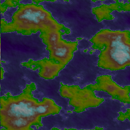

Tutorial 3: Terrain Maps
========================

In this tutorial, you'll create a program that generates and renders
a terrain height map from the output of a noise module.

Unlike the original pynoise, the functions of its noiseutils are built into
pynoise, so that you will be able to immediately output useful terrain maps
without anything extra.

Creating the terrain height map.
--------------------------------

As in previous tutorials we will create a Perlin noise source::

    from pynoise.noisemodule import Perlin

    perlin = Perlin()

Now we can create a noisemap from this noise source. A noise map is a 2D array
of noise value from a given source, which can be used in games or put into images.::

    from pynoise.noisemodule import Perlin
    from pynoise.noiseutil import noise_map_plane

    perlin = Perlin()
    noisemap = noise_map_plane(width=256, height=256, lower_x=2, upper_x=6, lower_z=1, upper_z=5, source=perlin)

.. note::
  Appending _gpu to the end of noise_map_plane will enable the gpu acceleration
  built into pynoise. In many case this will result in dramatic speed increases.

Running this however will not do anything, as you're building a noisemap and then
throwing it away. We need two more things to render some noise: a color scheme
(called a gradient in pynoise) and a renderer.

Add these lines below from pynoise.noiseutil ...::

    from pynoise.noiseutil import terrain_gradient
    from pynoise.noiseutil import RenderImage

And add these lines below noisemap = ...::

    gradient = terrain_gradient()
    render = RenderImage()
    render.render(256, 256, noisemap, 'terrain.png', gradient)

Running this will now output the below image:

Pretty neat? The image renderer comes with a variety of different options for lighting
such as intensity, color and direction.

if we change::

    render = RenderImage()

to::

    render = RenderImage(light_enabled=True)

we now get:

This brings out some of the detail, but it's still rather boring, so lets increase the
contrast a bit. We do this by passing the light_contrast variable into RenderImage::

    render = RenderImage(light_enabled=True, light_contrast=3)

and now we get:

Which shows even more detail, but it's pretty dark (darker than our original without
lighting even), so lets increase the brightness a bit, with the variable light_brightness::

    render = RenderImage(light_enabled=True, light_contrast=3, light_brightness=2)

which results in:

which is much brighter, and now we have lots of detail showing.

Tiling terrain height maps
--------------------------

This biggest advantage of using coherent noise is that you don't have to generate
everything. You can generate subsections of a map, as you need them, and they will
stitch together seamlessly.

Here we can shift to the left, and show the previous step next to the shifted one,
and you'll see that they combine together seamlessly

replace your noisemap with::

    noisemap = noise_map_plane(256, 256, 6, 10, 1, 5, perlin)

and view them side by side and you'll see:

