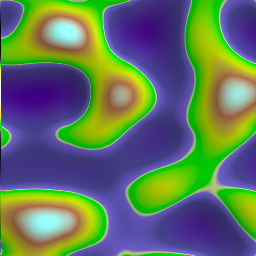
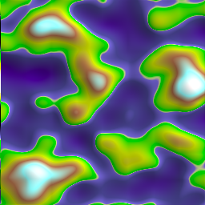
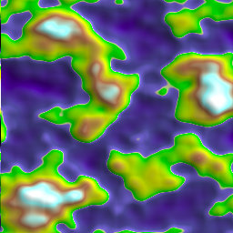
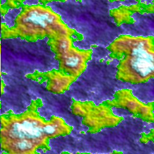
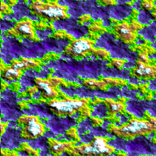
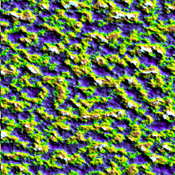
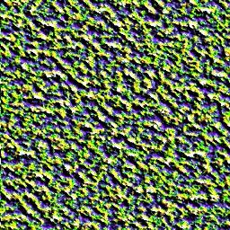
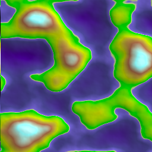
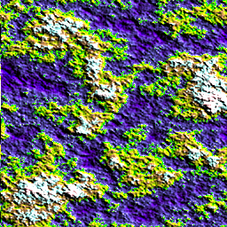

Tutorial 4: Modifying noise modules
===================================

We'll be using code from :doc:`tutorial3`. If you haven't read that, here
is the code we ended up with
::

    from pynoise.noisemodule import *
    from pynoise.noiseutil import *

    p = Perlin()
    g = terrain_gradient()

    nm = noise_map_plane_gpu(256, 256, 6, 10, 1, 5, p)
    r = RenderImage(light_enabled=True, light_contrast=3, light_brightness=2)

    r.render(256, 256, nm, 'terrain4.png', g)

Modifying the number of octaves
-------------------------------

We have been using Perlin noise as our base noise. Perlin noise is a combination
of several different 'octaves' of noise, all added together to create the final
product. Each octave has an increasing frequency (how often structures in the noise
repeat) and a decreasing amplitude (the range between the highest output value and the
lowest output value). The Perlin module defaults to an octave count of 6.

Let's change the octave counts of our Perlin noise and see what happens::

    p = Perlin(octaves=1)

With 2 octaves::

    p = Perlin(octaves=2)

With 3 octaves::

    p = Perlin(octaves=3)

With 4 octaves::

    p = Perlin(octaves=4)

.. image:: img/octave4.png

With 5 octaves::

    p = Perlin(octaves=5)

With 6 octaves::

    p = Perlin(octaves=6)

.. image:: img/octave6.png

Modifying the frequency
-----------------------

Next we'll modify the frequency of the Perlin noise. The frequency determines
how many changes along a unit length. Increasing the frequency adds to the
number of interesting features in the noise, which also making each feature
smaller as more are packed into a given area. For these example we will set the
octaves back to the default of 6. The default frequency is 1.

At a frequency of 1::

    p = Perlin(frequency=1)

At a frequency of 2::

    p = Perlin(frequency=2)

At a frequency of 4::

    p = Perlin(frequency=4)

At a frequency of 8::

    p = Perlin(frequency=8)

Modifying the persistence between octaves
-----------------------------------------

And lastly, we will modify the persistence variable. Persistence determines how
quickly the amplitudes decrease between each octave. An increased persistence will
produce a rougher noise output, whereas a decrease persistence will result in
smoother noise maps. The default is 0.5, and you get the best results when it ranges
between 0 and 1.

At a persistence of 0.25::

    p = Perlin(persistence=0.25)

At a persistence of 0.5::

    p = Perlin(persistence=0.5)

.. image:: img/persistence1.png

At a persistence of 0.75::

    p = Perlin(persistence=0.75)

Conclusion
----------

All of these base noises have these three features, and they all modify the base
noises in a similar way. Feel free to experiment and come up with something cool.
