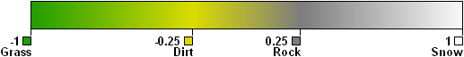
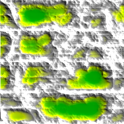
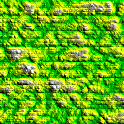
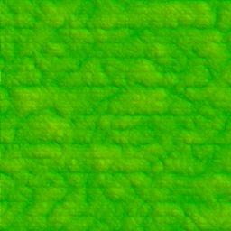
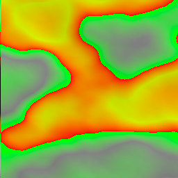
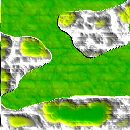
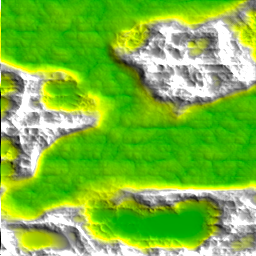

Tutorial 5: Generating more complex terrain
===========================================

Combining noise modules
-----------------------

In pynoise most of the modules do not directly generate noise. Most of the
included modules add to, modify or otherwise transform the base noises. In this
tutorial you will combine 5 different noise modules to create something that
you would not be able to generate using pure Perlin (or any other) noise.

Starting out with some color
----------------------------

The previous tutorial used the built in terrain gradient; however, this may not
always suit your needs, especially if you're only generating land. So we will
start off by creating our own gradient.::

    from pynoise.noisemodule import *
    from pynoise.noiseutil import *
    from pynoise.colors import Color

    gradient = GradientColor()
    gradient.add_gradient_point(-1, Color(0.125, 0.627, 0))
    gradient.add_gradient_point(-0.25, Color(0.87, 0.87, 0))
    gradient.add_gradient_point(0.25, Color(0.5, 0.5, 0.5))
    gradient.add_gradient_point(1, Color(1, 1, 1))

Which looks like this:

Now that we have our gradient system, we can start creating out system of noises.
We'll be making terrain that has some mountainous regions, interspersed with
some valleys containing lots of pretty green flat land.

Generating the rough mountainous terrain
----------------------------------------

To generate this terrain we will use a type of noise called Ridged Multi-Fractal
noise. Add some to your file, and we'll render the result.::

    rmf = Ridgedmulti()

    noisemap = noise_map_plane_gpu(256, 256, 6, 10, 1, 5, rmf)
    render = RenderImage(light_enabled=True, light_contrast=3, light_brightness=2)
    render.render(256, 256, noisemap, 'tutorial5.png', gradient)

Looks pretty cool, but our valleys are pretty small and not very flat. Let's fix
that.

Generating the base values of the flat terrain
----------------------------------------------

Now, using a Billow noise module, we will create terrain that generates a lumpy
look, like smooth rolling hills of bountiful plains. Add these lines to your file::

    billow = Billow(frequency=2)
    
and change your noise map like so::

    noisemap = noise_map_plane_gpu(256, 256, 6, 10, 1, 5, billow)

rendering that results in

But that doesn't look right, some of our rolling 'hills' are snow capped mountains!
This is because most of our modules output from -1 to 1. We've interpreted 1 to mean
our highest height, and thus out billow noise makes rolling valleys and mountains.

Generating the flat terrain
---------------------------

We need to scale this terrain so it doesn't have such a large range of values, and
have it average closer to the bottom of our terrain (-1) so that it doesn't merge
with our previous mountainous terrain. We do all of this with one module, ScaleBias.::

    flatten = ScaleBias(source0=billow, scale=0.125, bias=-0.75)

This takes in our billow noise, scales the noise so that it outputs values from
-0.125 to 0.125 instead of -1 to 1. And then moves the average to -0.75 instead of 0
giving it an approximate range -0.875 to 0.625. Which is a much better height range
for some valleys at the bottom of our terrain. Now if we render *flatten* instead of
billow::

    noisemap = noise_map_plane_gpu(256, 256, 6, 10, 1, 5, billow)

we will see more grassy plains, and less mountains.

Now we'll work on smushing these two together.

Generating the terrain-type map
-------------------------------

How do we choose if something is all mountainy or all planey? More noise of course.
Here we will create a low frequency, low persistence Perlin noise that will be used
to choose our terrain type. The low frequency and persistence will create more smooth
wider features, which we result in large contigious terrain types being selected. So
under your ScaleBias module add::

    terrain_pick = Perlin(frequency=0.5, persistence=0.25)

This will create a noise map that looks like the below with red colored terrain being
selected as plains, and green colored terrain being selected as mountains.

Generating final terrain
------------------------

Finally, we can put all of this together and get a better looking terrain map. We
do this with a Select module. This module outputs the same value from two source
modules (in this case our rmf and flatten) which source it outputs from is determined
by a third source, in our case being `terrain_pick`. Lets add it
::

    final = Select(source0=flatten, source1=rmf, source2=terrain_pick, lower_bound=0, upper_bound=1000)

`lower_bound` and `upper_bound` are the values to help determine which noise is output
when. If the output value of our selector noise `terrain_pick` is between
`lower_bound` and `upper_bound` then we output source1. Otherwise, the Select module
will output the value from source0. Rendering the Select module will give us this

Looks better, but you'll notice that it's a pretty harsh transition between our
two terrain types. We can ease that by blending the two maps together at our
boundry point (0) by adding the parameter edge_falloff to our select module.
::

    final = Select(source0=flatten, source1=rmf, source2=terrain_pick, lower_bound=0, upper_bound=1000, edge_falloff=0.125)

This means for any value within 0.125 of our boundrys we blend source0 and source1.

Much much better. Lets move on to :doc:`tutorial6` now.
