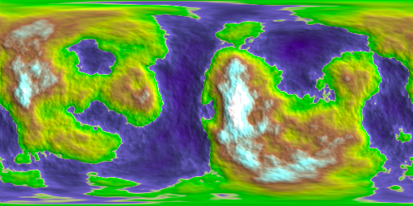
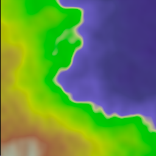

Tutorial 7: Creating spherical terrain
======================================

All of the previous tutorials created planar maps. However, if
you want to render these maps onto a sphere, such as in a planet
these mappings will look bad.

Thankfully pynoise has built in noise mappers for a sphere, which
will generate the maps for properly wrapping around a sphere.

The code we will be using is pretty similar to the end of :doc:`tutorial3`
::

    from pynoise.noisemodule import *
    from pynoise.noiseutil import *

    perlin = Perlin()
    gradient = terrain_gradient()
    noisemap = noise_map_sphere_gpu(width=512, height=256, west_bound=-180, east_bound=180, north_bound=90, south_bound=-90, source=perlin)
    render = RenderImage(light_enabled=True, light_brightness=2, light_contrast=3)
    render.render(512, 256, noisemap, 'tutorial7.png', gradient)

As this is a sphereical mapping, we can't just use plain x,y,z coordinates, as don't map
well onto spheres, instead our bounds are lat/lon values. Since we are
rendering the entire sphere, we cover everything with -180 west to 180 east.

our output looks like the below. Notice how the left and right are seamless, which will work well
for wrapping around a sphere.

    
It wraps nicely onto a sphere, `as you can see here <https://jsfiddle.net/1Lbckw2j/>`_.

Zooming in
----------

Even cooler, we can zoom into a small area of our planet. We'll zoom
into a rectangular section with
 
 * The southernmost coordinate N0
 * The northernmost coordinate N30
 * The westernmost coordinate E50
 * The easternmost coordinate E80

Thus, we change our noisemap to be
::
  
    noisemap = noise_map_sphere_gpu(width=256, height=256, west_bound=50, east_bound=80, south_bound=0, north_bound=30, source=perlin)
    
    render.render(256, 256, noisemap, 'tutorial7-1.png', gradient)

and now we can see a zoomed in section. Because the area we've defined is a square 
(30 by 30 opposed to 360 by 180), we need to render it a square.

However, this looks a bit fuzzy. This is because there aren't enough octaves in our Perlin
noise to add that fine detail. Remember each successive octave adds finer and finer detail
to our noise map. Normally, we are zoomed so far out, that we cannot see that detail, but
in this case it's needed.
::

    perlin = Perlin(octaves=10)

and now look, better detail, while still preserving the overall structure.

